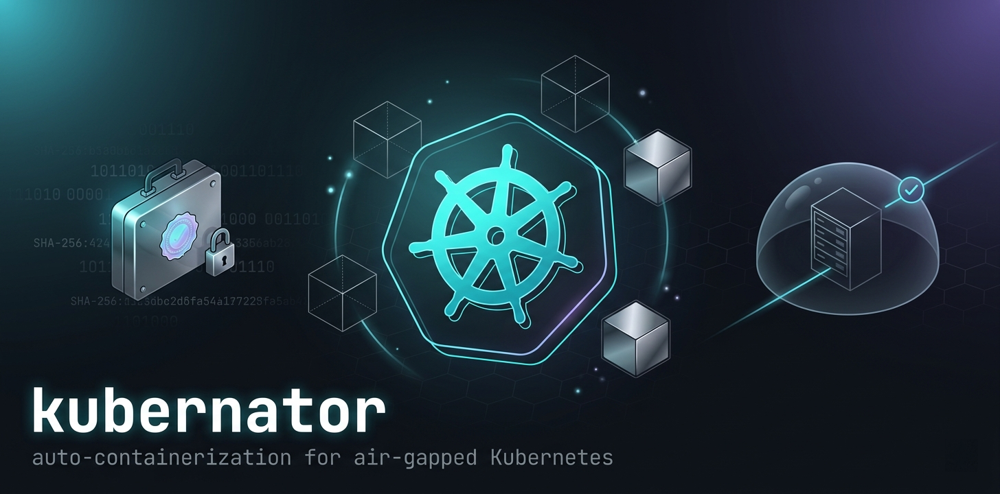

A .NET 10 command-line tool that turns a published application into a hardened, signed,
air-gapped-friendly Kubernetes deployment. It detects what you've built, picks an
appropriate base image, writes a Dockerfile and Kubernetes manifests, and — if you ask —
packs the image plus everything needed to install it into a single `.kubpack` archive
that can be carried into a network with no internet access.

The tool is opinionated on purpose. Generated artifacts run as non-root on a read-only
root filesystem, drop all Linux capabilities, default to a NetworkPolicy that denies
egress, and reference container images only from a small allow-list of trusted
registries (`mcr.microsoft.com`, `cgr.dev/chainguard`, `gcr.io/distroless`,
`registry.k8s.io`).


## Status

Pre-1.0. The command surface is stable enough to use, but option names and bundle
schema may still change between minor versions.

## What it does

- **Detects** the application stack from a published output directory: .NET (console,
  worker, ASP.NET, Blazor, gRPC, native AOT, self-contained), Node.js (Express, Next,
  Nest, Fastify), Python (Flask, FastAPI, Django), Java (Spring Boot, Quarkus), Go and
  static-web bundles.
- **Generates** a Dockerfile, `.dockerignore`, and a full Kubernetes manifest set
  (`Deployment`, `Service`, optional `Ingress`, `HorizontalPodAutoscaler`,
  `PodDisruptionBudget`, `NetworkPolicy`, `ServiceAccount`).
- **Builds** the container image through Docker, Podman, or any other engine that
  speaks the same CLI.
- **Bundles** the image, manifests, SBOM, install scripts, and a digest manifest into a
  portable `.kubpack` file for air-gapped transfer.
- **Signs and verifies** bundles with a cosign-compatible ECDSA P-256 signature.
- **Scans** dependencies against a local OSV-derived vulnerability database — no calls
  to the public internet at scan time.
- **Validates** the build end-to-end on a disposable [kind](https://kind.sigs.k8s.io/)
  cluster, and **deploys** to a real cluster through `kubectl` with a production guard.
- **Emits** Helm charts, Kustomize bases with environment overlays, Argo CD
  `Application`/`AppProject` resources, and CI pipelines for GitHub Actions, GitLab CI,
  Azure DevOps, or Tekton.
- **Provisions** an air-gapped HA Kubernetes cluster (RKE2, k3s, or kubeadm) over SSH or
  locally, pulling all offline artifacts up front — and **monitors** an existing cluster:
  node health, pods, ingress, network policies, and live metrics.
- **Rehosts** images into a private registry behind an air gap and **audits** rendered
  manifests against the kubernator secure baseline.
- **Self-updates** from a signed release manifest you host yourself, so an offline
  workstation can be upgraded from a USB stick.

## Install

Pre-built single-file binaries are produced for `linux-x64`, `linux-arm64`, `osx-x64`,
`osx-arm64`, and `win-x64`. Download the archive for your platform from the GitHub
release, extract it, and place the binary somewhere on `PATH`.

The release page also publishes a `release.json` manifest and `checksums.txt`. Verify
the SHA-256 of the archive before extracting:

```sh
openssl dgst -sha256 kubernator-0.5.0-linux-x64.tar.gz
```

To build from source you need the .NET 10 SDK:

```sh
dotnet publish src/Kubernator.Cli -c Release \
  -r linux-x64 --self-contained true \
  -p:PublishSingleFile=true \
  -p:IncludeNativeLibrariesForSelfExtract=true
```

## Quick start

Given an ASP.NET Core app published to `./publish`:

```sh
kubernator analyze ./publish
kubernator generate ./publish --namespace shop --replicas 3 --hostname shop.example.com
kubernator build    ./publish --name shop --tag 1.0.0
kubernator bundle   ./publish --namespace shop -o ./out/shop-1.0.0.kubpack
```

The result is a single `.kubpack` archive containing the OCI image as a tarball, the
rendered Kubernetes manifests, an SBOM (CycloneDX, produced via syft when available),
an `install.sh` script that loads the image and applies the manifests, and a
`manifest.json` listing every file with its SHA-256.

To prove the bundle reaching its destination is the same one that left:

```sh
kubernator keygen -o ./keys
kubernator sign   ./out/shop-1.0.0.kubpack --key ./keys/cosign.key
kubernator verify ./out/shop-1.0.0.kubpack --require-signature
```

Running `kubernator` with no arguments launches the interactive `wizard`.

## Commands

| Command      | Purpose                                                                                                               |
| ------------ | --------------------------------------------------------------------------------------------------------------------- |
| `analyze`    | Inspect a published output and report the detected runtime, framework, dependencies, and exposed ports.               |
| `generate`   | Write a `Dockerfile`, `.dockerignore`, and Kubernetes manifests under `<path>/.kubernator/`.                          |
| `build`      | Generate, then build the container image with Docker, Podman, or compatible.                                          |
| `bundle`     | Build everything and pack it into an air-gapped `.kubpack` archive.                                                   |
| `pull`       | Pull images from a registry and save them as transferable `.tar` files for offline use.                              |
| `rehost`     | On an air-gapped host, load bundled images, retag under a private registry, push, and rewrite manifest image refs.    |
| `verify`     | Recompute hashes and (optionally) verify the cosign signature of a bundle.                                            |
| `keygen`     | Produce a cosign-compatible ECDSA P-256 key pair.                                                                     |
| `sign`       | Sign a bundle with a private key, emitting a detached `.sig` file.                                                    |
| `pipeline`   | Generate a CI/CD pipeline for `gh-actions`, `gitlab-ci`, `azure-devops`, or `tekton`.                                 |
| `helm`       | Render a Helm chart with parameterized templates; optionally `helm package` it.                                       |
| `kustomize`  | Render a Kustomize base plus `production`, `staging`, and `dev` overlays.                                             |
| `gitops`     | Render Argo CD `Application` and `AppProject` resources for GitOps delivery.                                          |
| `tls-rotate` | Render a `ServiceAccount` + `Role` + `RoleBinding` + `CronJob` that rotates a self-signed TLS `Secret` on a schedule. |
| `vulndb`     | Manage the offline vulnerability database (`status`, `update`, `import-zip`, `import`, `export`).                     |
| `scan`       | Scan an application against the local vulnerability database, with severity gating.                                   |
| `validate`   | Spin up a kind cluster, load the image, apply the manifests, run a probe.                                             |
| `deploy`     | Deploy generated manifests to a Kubernetes cluster via `kubectl`, with a production guard and `--dry-run`.            |
| `monitor`    | Snapshot or watch cluster state: node health, pods, ingress, network policies, and live metrics.                     |
| `audit`      | Audit a manifests directory against the kubernator secure baseline (AUD codes).                                       |
| `cluster`    | Pull offline artifacts and provision or upgrade an air-gapped HA cluster (RKE2/k3s/kubeadm) over SSH or locally.      |
| `vault`      | Manage the local key & cert vault (`list`, `import`, `remove`).                                                       |
| `doctor`     | Probe the environment (engine, kubectl, kind, vulndb, state directory) and report what is missing.                    |
| `version`    | Print the version and platform identifier.                                                                            |
| `update`     | `update check` or `update apply` against a release manifest URL or local path.                                        |
| `wizard`     | Interactive flow (alias `ui`).                                                                                        |

Run `kubernator <command> --help` for the full option list of any command.

## How a bundle is laid out

A `.kubpack` is a deterministic tar archive with a fixed structure:

```
manifest.json        schema, tool version, app metadata, hash of every member
images/              one tar per OCI image, named by its sha256
manifests/           the rendered Kubernetes YAML
sbom/                CycloneDX SBOM(s) when syft is available
scripts/             install.sh / uninstall.sh / load-images.sh
NOTES.txt            human-readable summary of what is inside
```

The optional detached signature lives next to the bundle as `<name>.kubpack.sig` and is
produced by `kubernator sign` (cosign-compatible; the public key alone is enough to
verify).

## Air-gapped delivery

The motivating use case is delivering software into an environment with no outbound
network access:

1. On a workstation with internet, build the bundle and sign it.
2. Carry the `.kubpack` and the signing public key into the destination network.
3. On the target side, `kubernator verify --require-signature` to check integrity and
   provenance, then run the included `install.sh`, which loads the image into the local
   container registry and `kubectl apply -f` the manifests.

For the offline vulnerability database, `kubernator vulndb export --bundle vulndb.tar.gz`
on the connected side and `kubernator vulndb import --bundle vulndb.tar.gz` on the
air-gapped side keep `scan` working without network access.

For self-update, `kubernator update apply --source ./release.json` accepts a local
manifest, so an upgrade can be shipped on the same USB stick as the bundles it
produces.

## Generated security defaults

Every generated `Deployment` includes a `securityContext` with `runAsNonRoot: true`,
`readOnlyRootFilesystem: true`, `allowPrivilegeEscalation: false`,
`capabilities.drop: [ALL]`, and a non-zero `runAsUser` matching the chosen base image
(`1654` for Microsoft chiseled images, `65532` for Chainguard images).

The `NetworkPolicy` is default-deny on egress; you opt in to outbound traffic
explicitly. A `PodDisruptionBudget` is rendered whenever the replica count or the
relevant flags justify one.

Ingress rendering supports four TLS modes: `none`, `self-signed`, `cert-manager`
(Issuer or ClusterIssuer), and `user` (bring your own PEM cert/key). Combined with
`tls-rotate`, a self-signed certificate can be rotated periodically without operator
intervention.

## Project layout

```
src/
  Kubernator.Core      detection, strategy selection, generators, bundling, vuln scan
  Kubernator.Runtime   container engine adapters (Docker / Podman / containerd via CLI)
  Kubernator.Cli       Spectre.Console CLI surface
  Kubernator.Web       Blazor Server UI + REST API (mirrors the CLI, with API-key auth)
tests/
  Kubernator.Core.Tests
  Kubernator.Cli.Tests
  Kubernator.Runtime.Tests
  Kubernator.Web.Tests
.github/workflows/
  ci.yml               build + test on every push and pull request
  release.yml          single-file publish for five platforms, release manifest, checksums
```

`Kubernator.Core` has no dependency on the CLI or the web project. Anything you can do
through the CLI you can do by referencing `Kubernator.Core` directly.

## Embedded third-party tools

A few external CLIs are used when present and downloaded into `~/.kubernator/tools/`
when missing, with their hashes verified against a pinned manifest. The integration is
optional — features that depend on a missing tool degrade gracefully and `doctor` will
tell you what is unavailable:

- `cosign` — signing and verification when you prefer it over the built-in flow
- `syft` — SBOM generation
- `trivy` — supplementary vulnerability scanning
- `helm` — packaging Helm charts produced by `kubernator helm --package`

## Building and testing

```sh
dotnet build kubernator.sln
dotnet test  kubernator.sln
```

The unit tests across `Kubernator.Core`, `Kubernator.Cli`, `Kubernator.Runtime`, and
`Kubernator.Web` do not require Docker, kubectl, or kind. End-to-end coverage of
`validate` requires kind and kubectl on `PATH`.

## Contributing

Issues and pull requests are welcome. Two ground rules: keep generated output free of
comments and AI-style boilerplate, and never widen the registry allow-list without a
discussion — the small allow-list is a feature, not an oversight.

## License

See `LICENSE` in the repository root.
